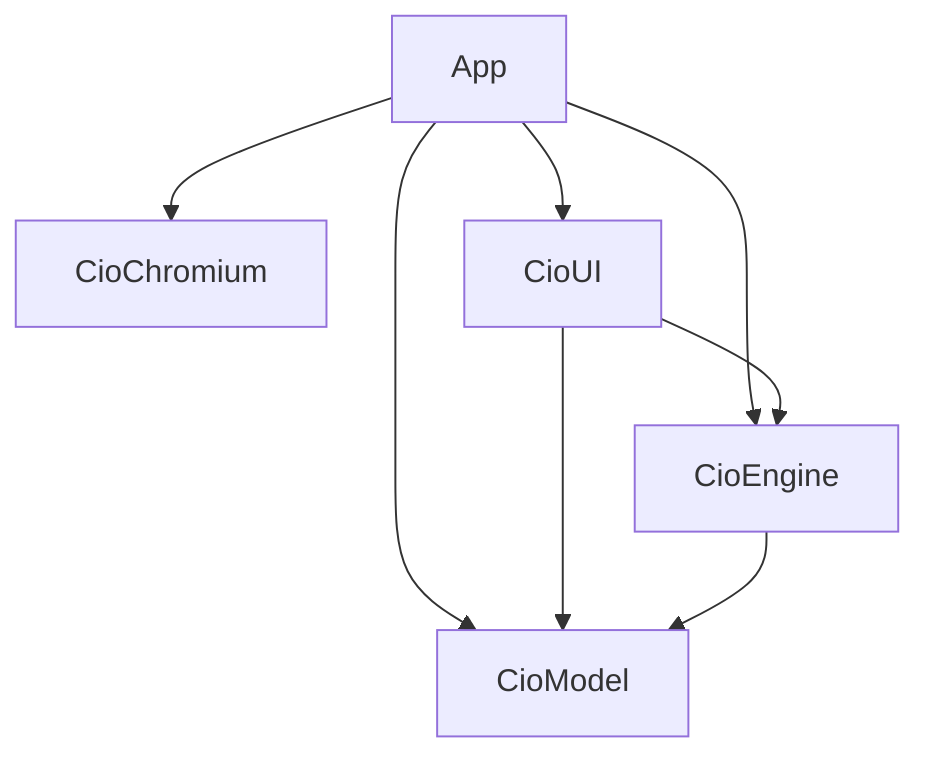

# Cio architecture

当前引擎实现（2026-10-08）：`chromium-native`，由 GN 编译 Chromium 152 和
`Engine/CioChromium/Native` 补丁。Swift 通过 `CioChromium.framework` 的公开
Objective-C 接口调用；`NativeLoader` 负责初始化，AppKit 循环泵送保留的
BrowserMainRunner。Chrome Settings 与原始 popup WebContents 使用 Cio 标签容器，
不创建 Chromium 浏览器外壳。源码归属、窗口适配及独立升级边界见
[引擎说明](Engine/Chromium/README.md) 和 [第三方许可](THIRD_PARTY_NOTICES.md)。


This document describes the checked-in implementation. Layout and native-control contracts in AGENTS.md remain authoritative. There is no staged feature specification or alternate historical design.

## Process and ownership

The macOS 26+ application uses Swift 6, SwiftUI, AppKit, Objective-C++ and native Chromium. Swift code never owns a Chromium C++ object. XcodeGen's project.yml is the only project definition; the generated Xcode project is not tracked.

```text
BrowserMain
  -> CioChromium.framework
       -> ChromiumProcessHost      native loader, retained startup and task pump
  -> CioApp              single SwiftUI Window scene and native menu
       -> ApplicationRuntime       application-scoped services and termination
            -> BrowserWorkspaceStore
                 -> WorkspaceCollection
                      -> BrowserSpace / BrowserTab / BrowserSplitLayout
                      -> durable WorkspaceSessionSnapshot
                      -> recently closed snapshots
                 -> BrowserSessionManager
                      -> tab UUID -> BrowserSession -> BrowserBridge -> Browser / WebContents
                      -> tab UUID -> ChromiumContainerView
                      -> stable BrowserSurfaceHostView
            -> SessionStore
            -> HistoryService -> HistoryStore (SQLite)
            -> DownloadManager
```

The app, CioChromium loader framework and standalone unit-test bundle are Xcode targets. Chromium and its standard helpers are GN targets. CioModel is a local Swift 6 package under Packages/CioModel with no package dependencies; App and tests import the same library. It contains workspace/tab/split/snapshot values, navigation parsing and URL redaction. Split geometry uses system CoreGraphics value types, with no AppKit, SwiftUI or Chromium. Four suites run with swift test; remaining native/model tests use the standalone XCTest target. No test host starts Chromium for unit tests.

## Local Engine boundary

Packages/CioEngine depends only on CioModel. BrowserSessionProtocol and BrowserWorkspaceProtocol expose the existing navigation/editing/selection operations and original publishers; BrowserAddressEditing is implemented by the existing UI model. Each member's current caller is listed in docs/engine-interface.md. NavigationState, translated download values, site information and the original history/session/download/autocomplete services are Chromium-free Engine code. Their algorithms and Runtime-owned instances are retained.

BrowserSession and BrowserWorkspaceStore remain App implementations. Workspace focus/navigation/metadata/popup policy uses the session protocol. App-only concrete session lookup, runtime creation, registry and typed close acceptance/cancellation/WebContents destruction callbacks remain with the original manager and termination coordinator. Publisher projections only erase the original @Published streams; downstream ordering and native controls are retained. Engine never imports UI, Bridge or Chromium.

## Local UI boundary

Packages/CioUI depends on CioEngine and CioModel. It owns the native shell, address editor, page/toolbar presentation, sidebar/Spotlight/internal/settings views and shared Animation directory. It has no App, Bridge or Chromium import. The scroll-edge Metal shader is processed into the package resource bundle and the same shader function is looked up through Bundle.module.



App creates one BrowserUIContext using the original Runtime publisher, workspace, services and manager. Panel access/action closures forward synchronously to Runtime. ObservedEngine returns the original protocol object and subscribes directly to its original publisher; it owns no copied state or relay. BrowserSurfaceDriverProtocol is a UI-owned native presentation/factory seam implemented by the App manager. The factory retains configure → covered-state → attach order; representable updates re-adopt the same host.

ChromiumView, ChromiumContainerView, BrowserSession and BrowserSessionManager remain App code. BrowserNativeSurface.nativeView is the same original container. Its session accessor resolves the original weak delegate, so moving the page into UI does not add a strong session reference. Global process appearance is injected into the host and still runs before the original per-session appearance callback. See docs/ui-injection.md for the boundary audit.

## Chromium boundary and bundle

BrowserMain performs subprocess handoff before UI work, initializes the hosted Chromium runtime before SwiftUI and starts Cio's AppKit loop. CioChromium reexports the native Objective-C bridge implemented in libchrome_dll; only GN sources include Chromium C++ headers. BrowserMainRunner and ContentMainRunner stay alive until Cio's managed sessions close and cookies are flushed. Native callbacks execute on the main thread.

Scripts/package_native_chromium.py bundles Chromium Framework.framework, its four standard Helpers (browser/utility, Alerts, GPU and Renderer) and all component dylibs. Every image has bundle-relative runtime paths. The packager signs nested code; Xcode seals the outer app. Scripts/verify_bundle.sh validates the static dependency graph, native exports, signatures and licenses without starting the app. NativeLoader copies a legacy CEF profile only while it is inactive, preserving the original directory.

The old CEF implementation, custom Helper and CEF build/install/package scripts have been removed. No active source, target or package requires CEF headers, a CEF framework or libcef_dll_wrapper. Legacy diagnostic labels and download callback names remain compatible with existing callers; they identify native-engine events and translated values, not a second backend. Profile migration is data compatibility only.

## Domain, selection and persistence

WorkspaceCollection owns ordered Spaces, domain tab identities, membership, selected Space/tab, top pins, space pins, temporary tabs, split groups and the bounded recently-closed stack. BrowserSpace, BrowserTab, BrowserSplitLayout and snapshot values contain no Chromium runtime objects.

Top pins remain visible across Spaces. Space pins belong to their Space; temporary tabs are the default destination for new tabs. Each Space keeps a stableTabStack separate from sidebar order. Opening or activating a tab moves it to the top. Closing the selected tab skips stale identities and selects the newest valid stable tab, then a temporary tab, then another remaining tab or a replacement in the same Space. Background close does not rewrite that stack.

BrowserWorkspaceStore is the mutable domain owner and owns selection transitions. BrowserSessionManager retains only instantiated sessions, their containers and typed callbacks. A closing runtime remains registered until WebContents destruction. The application has no second liveness registry.

SessionStore writes session-v1.json under ~/Library/Application Support/Cio/, or the explicit CIO_DATA_DIR override. The versioned Codable snapshot preserves exact URLs, titles, identities, ordering, selections, tiers and split state. Restore validates the graph before accepting it; malformed input falls back to the normal fresh workspace. Runtime loading state, focus, field edit buffers, Chromium history and recently-closed state are not restored. Only the selected tab's runtime is created at launch; activating a lazy tab creates it once, and closing a lazy tab never creates a browser just to close it.

Session/history files use private permissions and atomic session writes. Persistence failures are local and nonfatal. Existing data is not silently migrated between product namespaces.

## Surface and UI lifetime

MainWindowView hosts the AppKit shell through CioShellRepresentable. The application uses one Window scene because the workspace owns one set of native Chromium surfaces.

BrowserSurfaceHostView retains one BrowserPagePresentation per live session. A page retains its stable outer viewport, ChromiumContainerView and tab-bound BrowserToolbarController. Selecting tabs, changing sections or changing splits does not rebuild a Chromium view, create another browser or rebind a shared address editor. Containers are released only after their typed close callback. Presentation clipping and rounded corners belong to native outer viewports; Chromium receives rectangular rendering bounds.

BrowserWindowChromeView owns the native traffic lights and window gestures. BrowserMainViewController owns sidebar/section presentation and SpaceToolbarController. Toolbar controls mount above the shell backdrop, outside the Main View clip. Only Space displays the sidebar control and browser navigation/address controls. History, Downloads and Settings use native UI; switching sections retains the browser surface behind them.

The shell has one backgroundGlass backdrop. BrowserLayout in Packages/CioUI/Sources/CioUI/UI/Main/BrowserShellLayout.swift centralizes the 56 pt toolbar/rail, 4 pt equal right/bottom Main View insets and 14 pt content corners. Native traffic lights remain centered using their actual dimensions. The sidebar visible glass is 36 x 36 pt; Back and Forward occupy one continuous 72 x 36 pt interactive glass capsule in a 74 x 36 pt host. Stable native buttons and glass identities remain mounted across state changes. AGENTS.md and Packages/CioUI/Sources/CioUI/Animation/GLASS_COMPONENT_MOTION.md specify the full geometry and interaction contract.

## Focus and commands

BrowserSession's wantsPageFocus gates deferred creation focus and Chromium's own focus requests. A hidden or background session cannot take the keyboard merely because its browser or navigation completes. Releasing one browser only clears its own native responder; application termination explicitly releases page focus for teardown.

Each session owns an AddressFieldModel with a committed URL and independent edit buffer. Main-frame callbacks update the committed URL but do not overwrite text while editing. AddressField wraps native NSTextField, uses AppKit's shared field editor and preserves marked text. Return, Escape and field-editor commands are handled through native delegate methods; the code does not replace IME composition or implement a global keyboard monitor.

A tab selection ends the outgoing address edit, publishes the new presentation and returns focus to the incoming page. Sidebar selection explicitly requests page focus. Background metadata/URL callbacks do not mutate the active tab's buffer or selection. Pane selection and asynchronous focus delivery recheck current identity/visibility.

AppCommands installs menu key equivalents. Actions resolve the selected session when invoked:

| Shortcut | Current action |
| --- | --- |
| Cmd-L | Focus selected address field and select all |
| Cmd-R | Reload or stop selected page |
| Cmd-[ / Cmd-] | Back / Forward |
| Cmd-T | Open/toggle Spotlight for a new tab |
| Cmd-W | Close selected tab |
| Cmd-Shift-T | Reopen a fresh runtime from the latest closed snapshot |
| Cmd-1...Cmd-9 | Positional selection; Cmd-9 selects the last tab |
| Cmd-S | Toggle Space sidebar |
| Cmd-D | Move selected tab between Space pin and temporary |
| Option-Cmd-I | Toggle selected page's Web Inspector |
| Option-Cmd-U | View page source |

AppDelegate removes the competing standard window Cmd-W menu item; the red native close button still closes the window. The inspector's privileged transport is bound only to explicitly marked inspector browsers, never arbitrary page JavaScript.

## Navigation, popups, history and downloads

NavigationInput parses explicit schemes and URL-like input without modifying query/fragment identity. Other text becomes a Google search through SearchEngine. URLLogSanitizer is a single observability policy: scheme/host/port and parameter names remain; user-info, non-root path contents, query values and fragments are redacted. Navigation and private persistence receive exact URLs; no Chromium URL logging bypasses the sanitizer.

Chromium popup creation is intercepted after its popup blocker; the original WebContents is queued for adoption and its URL is forwarded to the source BrowserSession. The workspace resolves the source tab's Space (or selected Space for a top pin), inserts a managed tab after its source and selects it only when appropriate. No popup creates an unmanaged Chromium browser window. Live popup adoption preserves the original opener; Cio does not create Chromium top-level browser windows.

HistoryService records successful main-frame final URLs and titles, including visits after redirects; failed/provisional loads do not become visits. HistoryStore uses system SQLite. Downloads remain process-memory values. DownloadManager reduces names to safe components, keeps paths within the destination directory and chooses collision-safe names. Profile shutdown closes Chromium download services after the managed pages close. Download rows do not retain the originating BrowserSession.

Renderer termination marks that session as crashed and exposes a reload action while retaining its stable view; normal network failures remain navigation failures.

## Close and application termination

An ordinary close requests the native BrowserWindow close protocol. A native beforeunload alert can cancel without removing the domain tab or writing recently-closed state. The typed acceptance callback commits removal and completes the embedded view close. Termination is a separate force-close policy for all instantiated sessions.

```text
AppDelegate.applicationShouldTerminate
  -> start ApplicationRuntime.Terminator
  -> return terminateCancel (unwind the native event/Chromium stack)
  -> default run-loop step: flush snapshot, request all live closes
  -> typed WebContents destruction callbacks remove sessions and wake the coordinator
  -> live count reaches zero
  -> CioNativeShutdown once
  -> retry NSApp.terminate
  -> terminateNow
```

Repeated quit requests are idempotent. Production diagnostic waits do not turn a live browser into an unsafe CioNativeShutdown. shutdownBrowserEngine refuses while a session is live. There is no lifecycle-string control flow, forced release timer or terminateLater nested modal shutdown path. The narrowly gated deferred-close diagnostic used by the history/download self-test is not a production termination policy.

## Animation

Packages/CioUI/Sources/CioUI/Animation/ contains shared motion, tuning and persisted speed preferences. UI components reference named AnimationValues. Standard-pace timings are resolved once through AnimationValues.duration; curves and geometry do not scale with speed. Handoff, retention and cleanup waits share the captured flight clock. Reduce Motion and system-owned animation remain intact. Chromium scheduling, input debounce and polling are operational timing.

First-level glass motion uses the native materialize transition and shared position/size Spring implementation. Interrupted flights continue from their current geometry/velocity; equal destinations do not restart them. Page and toolbar reveal share the handoff transaction. Native controls/editors stay mounted and first-level motion is not recursively applied to their symbols or text.

## Verification and compatibility

Scripts/verify_current.sh validates the current implementation by responsibility. The required app build always uses CONFIGURATION=Debug Scripts/build.sh, with DerivedData under build/. verify_unit_tests.sh runs the standalone XCTest bundle and any extracted local-package tests. Runtime, rendering, navigation, tabs, workspace, restore, history/downloads and stability checks inspect actual compiled behavior. Release verification also builds through Scripts/build.sh.

Numbered verify_milestone scripts are compatibility forwarding entry points only. Diagnostic drivers/probes live in Cio/Diagnostics; HistoryDownloadsSelfTest and StabilitySelfTest replace numbered source/type names while keeping their CLI switches and trace labels. MainMenuDump remains App-owned because its native close-shortcut claiming is production menu behavior. Existing binary diagnostic switches and trace names are retained for tooling. Their historical output does not define the current design. The original baseline report is kept separately from current verification results.

The legacy --browser-self-test has a known nested-run-loop close limitation; it is retained unchanged and is not the rendering gate. Rendering verification uses normal app launch/page-load/typed termination. The legacy workspace driver contains three shared-address-editor focus expectations that no longer describe the tab-bound toolbar policy. check_workspace_report.py explicitly reports those as retired coverage, rejects every other failure and checks the remaining runtime invariants. Those checks are not claimed fixed or passing. Current address-field focus, IME, shortcuts, visual material outlines, split/drag motion and real Cmd-Q remain manual verification; see docs/manual-verification.md.
